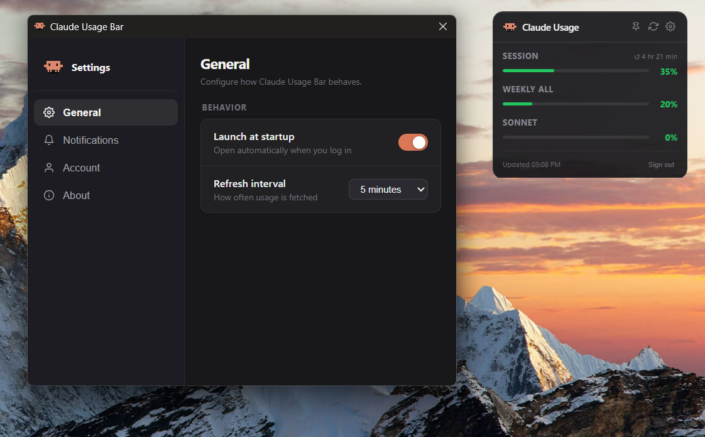

<div align="center">

<br/>



<br/><br/>

# Claude Usage Bar

**A minimal, always-on-top desktop widget that monitors your Claude AI usage in real time.**

[](https://www.electronjs.org/)
[](LICENSE)
[](https://www.electronjs.org/)

<br/>

</div>

---

## Features

- **Five usage bars** - Session, Weekly (All Models), Weekly Sonnet, Claude Design, and Extra usage
- **Color-coded status** - green -> orange -> red as usage climbs
- **System tray icon** - always visible with tooltip showing current usage
- **Smart notifications** - optional alerts at 80% and 95% session usage
- **Configurable refresh** - 1, 5, 10, or 30 minute intervals
- **Launch at startup** - automatic start on login (Windows & macOS)
- **Draggable & pinnable** - reposition anywhere, always-on-top toggle
- **Sign in without chat** - auth window closes cleanly before Claude chat opens
- **Settings panel** - accessible from the widget or tray menu
- **Cross-platform** - Windows 10/11, macOS 12+, Linux (AppImage / .deb)
- **Privacy-first** - reads data directly from your claude.ai session, no external servers

---

## Installation

### Pre-built binaries

Download the latest release from [GitHub Releases](https://github.com/Skw1/Claude-usage-bar/releases):

| Platform | File |
|----------|------|
| Windows (installer) | `Claude-Usage-Bar-Setup-1.0.0.exe` |
| Windows (portable) | `Claude-Usage-Bar-1.0.0.exe` |
| macOS (Apple Silicon + Intel) | `Claude-Usage-Bar-1.0.0.dmg` |
| Linux (AppImage) | `Claude-Usage-Bar-1.0.0.AppImage` |
| Linux (deb) | `claude-usage-bar_1.0.0_amd64.deb` |

### From source

**Requirements:** Node.js 18+, npm 9+

```bash
git clone https://github.com/Skw1/Claude-usage-bar.git
cd Claude-usage-bar
npm install
npm run dev          # development (hot reload)
```

---

## Usage

1. **Launch** the app - a small widget appears in the top-right corner of your screen
2. **Sign in** - click "Sign in" to open the Claude auth window and authenticate with your account. The window closes automatically after login.
3. **Monitor** - usage bars refresh automatically on your chosen interval
4. **Tray** - right-click the tray icon for quick access to Refresh, Settings, and more

### Widget controls

| Control | Action |
|---------|--------|
| **Drag** header | Reposition the widget |
| **Pin** button | Toggle always-on-top |
| **Refresh** button | Force refresh now |
| **Settings** button | Open Settings |
| **Sign out** | Clear session |

---

## Settings

Open via the Settings button in the widget or **Settings** in the tray menu.

| Setting | Default | Description |
|---------|---------|-------------|
| Launch at startup | Off | Start automatically when you log in (Windows & macOS) |
| Refresh interval | 5 min | How often usage data is fetched |
| Warn at 80% | On | Desktop notification when session hits 80% |
| Warn at 95% | On | Desktop notification when session is nearly full |

---

## Building from source

### Required icon assets

Place these files in the `build/` directory before packaging:

```
build/
  icon.ico     # Windows - 256x256 multi-resolution ICO
  icon.icns    # macOS   - 1024x1024 ICNS (via iconutil or makeicns)
  icon.png     # Linux   - 512x512 PNG
```

### Build commands

```bash
npm run build          # compile TypeScript + export Next.js static files

npm run dist:win       # Windows - NSIS installer + portable .exe
npm run dist:mac       # macOS   - Universal DMG (x64 + arm64)
npm run dist:linux     # Linux   - AppImage + .deb
```

Output files land in `release/`.

---

## Project structure

```
claude-usage-bar/
├── electron/
│   ├── main.ts              # App lifecycle, tray, IPC, windows
│   ├── preload.ts           # Secure IPC bridge -> widget renderer
│   ├── settings-preload.ts  # Secure IPC bridge -> settings renderer
│   ├── scraper.ts           # Hidden browser window that reads claude.ai/settings/usage
│   └── settings-manager.ts  # Reads/writes settings.json in userData
├── src/
│   ├── app/
│   │   ├── page.tsx         # Widget UI (transparent, frameless overlay)
│   │   ├── settings/
│   │   │   └── page.tsx     # Settings panel UI
│   │   ├── layout.tsx
│   │   └── globals.css
│   └── lib/
│       └── types.ts         # Shared TypeScript types
├── build/                   # Icon assets
├── docs/                    # Screenshots and assets
├── LICENSE
└── package.json
```

---

## How it works

1. At startup, a hidden Electron `BrowserWindow` loads `https://claude.ai/settings/usage` using your persisted Claude session cookie.
2. After the page settles, JavaScript is injected to extract progress bar values and reset times from the DOM.
3. The extracted data is sent to the widget via Electron IPC and displayed as color-coded bars.
4. The tray icon reflects the current usage level via tooltip.

No data is sent anywhere - everything stays local between Electron and claude.ai.

---

## Contributing

Pull requests are welcome. For major changes, please open an issue first.

1. Fork the repo and create a feature branch
2. Make your changes and test with `npm run dev`
3. Open a Pull Request

---

## Disclaimer

This project is not affiliated with or endorsed by Anthropic. Claude is a trademark of Anthropic PBC. This tool reads your own usage data from your own Claude session.

---

<div align="center">

MIT License - [Claude Usage Bar Contributors](https://github.com/Skw1/Claude-usage-bar/graphs/contributors)

</div>
